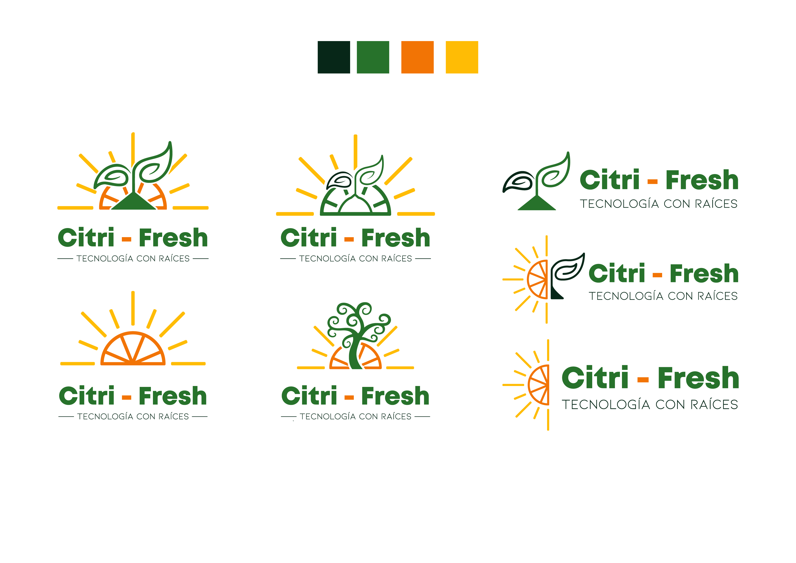
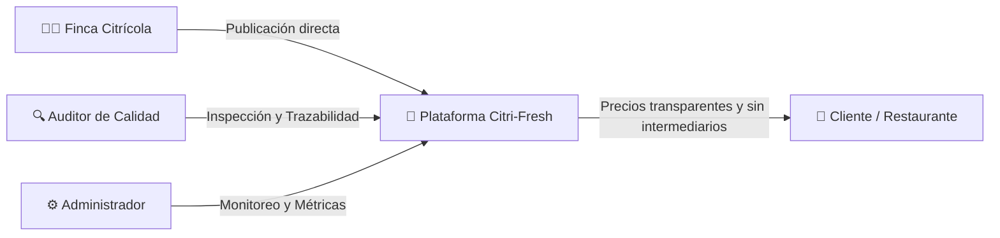
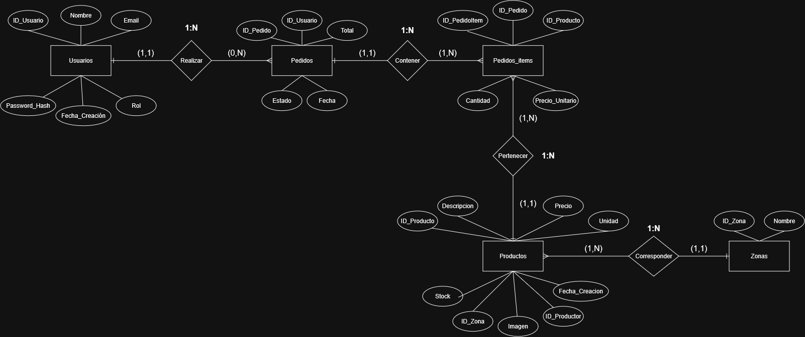
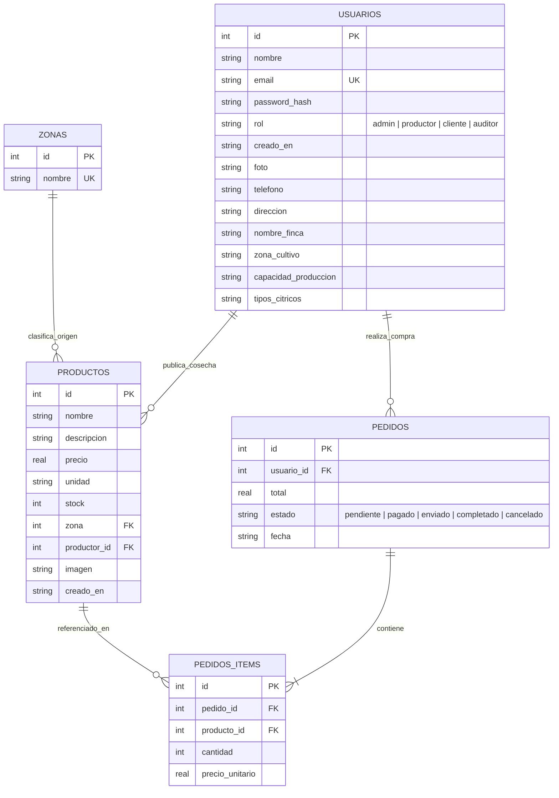

<div align="center">



# 🍊 CITRI-FRESH
### *Ecosistema Digital para la Comercialización Directa de Cítricos en Nicaragua*

[](https://opensource.org/licenses/MIT)
[](https://nodejs.org/)
[](https://expressjs.com/)
[](https://www.sqlite.org/)
[](https://vercel.com/)
[](#-hackathon-2026)

<p align="center">
  <b>Conectando fincas agrícolas con compradores directos, eliminando intermediarios y garantizando comercio justo y trazabilidad en el campo nicaragüense.</b>
</p>

[Explorar Catálogo](https://github.com/Citri-Coders/Citri-Fresh) • [Documentación de API](#-api-endpoints) • [Instalación Local](#-instalación-rápida) • [Despliegue](#-despliegue-en-producción)

---

</div>

## 📌 Tabla de Contenidos

1. [🏆 Hackathon 2026 & Visión](#-hackathon-2026)
2. [🌱 El Problema vs Nuestra Solución](#-el-problema-vs-nuestra-solución)
3. [👥 Matriz de Roles y Accesos](#-matriz-de-roles-y-accesos)
4. [🛠️ Stack Tecnológico](#️-stack-tecnológico)
5. [📊 Diagrama Entidad-Relación (Base de Datos)](#-diagrama-entidad-relación)
6. [📂 Estructura Detallada de Carpetas](#-estructura-detallada-de-carpetas)
7. [🚀 Instalación y Puesta en Marcha](#-instalación-y-puesta-en-marcha)
8. [📡 API REST Endpoints](#-api-endpoints)
9. [☁️ Despliegue en Producción (Vercel & Servidor Dedicado)](#-despliegue-en-producción)
10. [🔒 Seguridad, Resiliencia y PWA](#-seguridad-resiliencia-y-pwa)
11. [🎨 Recursos de Diseño y Branding](#-recursos-de-diseño-y-branding)
12. [👥 Equipo y Contacto](#-equipo-y-contacto)

---

## 🏆 Hackathon 2026

**Citri-Fresh** nace en el marco del **Hackathon 2026**, diseñado y construido por el equipo **Citri-Coders**. Nuestro propósito fundamental es acelerar la transformación digital del sector citrícola en Nicaragua (abarcando las zonas productivas de León, Chinandega, Carazo y Rivas), proveyendo una suite tecnológica accesible tanto desde dispositivos móviles en el campo como desde centros de distribución y hogares urbanos.



---

## 🌱 El Problema vs Nuestra Solución

| Desafío del Sector Tradicional | Solución Citri-Fresh |
|---|---|
| **Pérdida por Intermediación:** El agricultor recibe apenas el 30% del precio final. | **Venta Directa Punto a Punto:** El productor fija su precio y retiene hasta un 85-90% del valor comercial. |
| **Opacidad y Falta de Trazabilidad:** Desconocimiento del origen, variedad y frescura. | **Ficha Técnica Citrícola:** Detalle de región de cultivo, grados Brix, calibre, fecha de corte y certificaciones (Global GAP). |
| **Pérdida Post-Cosecha:** Fruta que se pierde por falta de canales comerciales rápidos. | **Mercado y Catálogo Reactivo:** Notificación y oferta inmediata de cosechas listas para recolección. |
| **Desconexión Tecnológica:** Brecha digital en zonas rurales. | **PWA Offline-First:** Sincronización en segundo plano (`CitriSync`) cuando el productor recupera conectividad celular. |

---

## 👥 Matriz de Roles y Accesos

El sistema implementa **RBAC (Role-Based Access Control)** integral con protección dual por cookies `HttpOnly` y middleware de servidor:

```
┌─────────────────┬────────────────────────────────────────────────────────────────────────┐
│ Rol             │ Capacidades y Entorno Asignado                                         │
├─────────────────┼────────────────────────────────────────────────────────────────────────┤
│ 🛒 Cliente      │ Catálogo completo, carrito dinámico (IVA 15% + flete), historial y     │
│                 │ seguimiento de órdenes de compra en tiempo real.                       │
├─────────────────┼────────────────────────────────────────────────────────────────────────┤
│ 👨‍🌾 Productor    │ Dashboard agrícola con ingresos semanales, inventario por calibres,    │
│                 │ registro de nuevas cosechas con fotos y actualización de pedidos.      │
├─────────────────┼────────────────────────────────────────────────────────────────────────┤
│ 🔍 Auditor      │ Vista fiscalizadora en modo sólo lectura de todas las operaciones,     │
│                 │ usuarios y cosechas, con emisión y exportación de Dictamen de Calidad. │
├─────────────────┼────────────────────────────────────────────────────────────────────────┤
│ 🛡️ Administrador│ Panel maestro de métricas globales, administración de usuarios, zonas, │
│                 │ catálogo general y geolocalización de áreas productivas.               │
└─────────────────┴────────────────────────────────────────────────────────────────────────┘
```

---

## 🛠️ Stack Tecnológico

### Frontend (Modern Vanilla Architecture)
- **HTML5 Semántico & Accesible:** Estructura modular preparada para lectores de pantalla y optimizada para SEO.
- **Vanilla CSS3 Modular:** Design tokens (`variables.css`), layout modular por componentes (`src/css/`), grids responsivas, micro-interacciones y tema adaptable.
- **JavaScript Moderno (ESModules):** Control de estado en cliente con `CitriAuth`, sincronización de pedidos `CitriSync` y carrito reactivo.
- **PWA Ready:** Service Worker registrado para cacheo de assets estáticos y funcionamiento offline en el campo.

### Backend & API REST
- **Node.js (v18+) & Express.js (v4):** Servidor HTTP estructurado bajo patrón **Controlador - Servicio - Modelo**.
- **SQLite3 & sqlite (async/await):** Base de datos relacional embebida, con soporte para inicialización en memoria/disco efímero (`/tmp`) en arquitecturas Serverless.
- **Seguridad HTTP:** `bcrypt` (10 rounds) para hashing de contraseñas, tokens JWT en cookies `HttpOnly`, `cors` adaptativo y `express-rate-limit` para defensa contra fuerza bruta.

---

## 📊 Diagrama Entidad-Relación

El modelo de datos relacional está normalizado para garantizar integridad referencial y trazabilidad completa entre zonas, fincas productoras, cosechas y órdenes de compra:

<div align="center">
  
</div>



---

## 📂 Estructura Detallada de Carpetas

La arquitectura real del proyecto está organizada de forma limpia separando la lógica del servidor, el frontend y los recursos de soporte:

```text
citri-fresh/
├── db/
│   └── schema.sql                  # Esquema DDL SQL con integridad referencial e índices
├── design/                         # Recursos de identidad visual y diseño
│   ├── logos/                      # Logotipos vectoriales y PNG (B/N y Color)
│   ├── manual/                     # Manual de identidad corporativa
│   ├── moodboard/                  # MoodBoard V2.0 de inspiración visual
│   ├── wireframes/                 # Prototipado y flujos de usuario
│   ├── paleta-colores.md           # Definición de paleta cromática citrícola
│   └── tipografia.md               # Pautas tipográficas (Kiona & Mont)
├── docs/                           # Documentación técnica y diagramas
│   ├── diagrama-er.png             # Diagrama Entidad-Relación visual
│   ├── api.md                      # Especificación detallada de endpoints
│   ├── seguridad.md                # Arquitectura de seguridad y mitigación de amenazas
│   └── testing.md                  # Casos de prueba funcionales
├── marketing/                      # Material comercial, pitch deck y estrategia
├── public/
│   └── images/                     # Favicons, apple-touch-icon y assets públicos
├── scripts/
│   ├── init-db.js                  # Inicialización manual de la base de datos
│   └── seed.js                     # Sembrado de usuarios y productos demo
├── server/                         # Backend Express (Patrón MVC Modular)
│   ├── config/
│   │   └── db.js                   # Conexión SQLite resiliente, migraciones y auto-seed
│   ├── controllers/
│   │   ├── authController.js       # Registro, login JWT, perfil y OAuth
│   │   ├── pedidoController.js     # Creación, cálculo y estados de pedidos
│   │   ├── productoController.js   # CRUD de cosechas con filtros por zona
│   │   └── zonaController.js       # Gestión de zonas geográficas
│   ├── middlewares/
│   │   ├── authMiddleware.js       # Verificación de JWT en cookies
│   │   ├── roleMiddleware.js       # Restricción RBAC de accesos
│   │   ├── corsMiddleware.js       # Política CORS adaptativa para nube y local
│   │   ├── rateLimitMiddleware.js  # Limitador de peticiones y login
│   │   └── validate*.js            # Validadores de carga útil (payloads)
│   ├── models/
│   │   ├── usuarioModel.js         # Consultas SQL para usuarios y productores
│   │   ├── productoModel.js        # Consultas SQL para catálogo e inventario
│   │   ├── pedidoModel.js          # Consultas SQL para órdenes y desglose
│   │   └── zonaModel.js            # Consultas SQL para regiones
│   ├── routes/
│   │   ├── authRoutes.js           # Rutas /api/auth
│   │   ├── productoRoutes.js       # Rutas /api/productos
│   │   ├── pedidoRoutes.js         # Rutas /api/pedidos
│   │   └── zonaRoutes.js           # Rutas /api/zonas
│   ├── services/
│   │   └── emailService.js         # Notificaciones por correo
│   ├── utils/
│   │   └── emailValidator.js       # Validaciones auxiliares
│   └── app.js                      # Configuración de Express y middlewares
├── src/                            # Frontend Servido al Cliente
│   ├── css/                        # Estilos modulares organizados
│   │   ├── base/                   # Reset y estilos base
│   │   ├── components/             # Botones, cards, badges, inputs
│   │   ├── fonts/                  # Definiciones tipográficas locales
│   │   ├── layout/                 # Grid, nav, footer, contenedores
│   │   ├── pages/                  # Estilos específicos de vistas
│   │   └── variables.css           # Design tokens CSS
│   ├── js/                         # Lógica JavaScript en cliente
│   │   ├── common/                 # Utilidades compartidas
│   │   ├── pages/                  # Lógica específica de vistas
│   │   └── app.js                  # Control de sesión, sincronización y eventos
│   └── pages/                      # Vistas HTML
│       ├── inicio.html             # Landing page principal
│       ├── producto.html           # Catálogo general de cítricos
│       ├── detalle_producto.html   # Ficha técnica y compra
│       ├── nosotros.html           # Historia, misión y visión
│       ├── carrito.html            # Carrito y checkout (Cliente)
│       ├── perfil.html             # Panel de cuenta y pedidos (Cliente)
│       ├── panel_productor.html    # Panel de métricas y ventas (Productor)
│       ├── registro_cosecha.html   # Publicación de cosechas (Productor)
│       ├── admin.html              # Dashboard maestro / Vista auditor (Admin / Auditor)
│       ├── registro.html           # Registro de cuentas
│       └── auth/
│           └── login.html          # Inicio de sesión moderno con split-card
├── server.js                       # Entrada para ejecución local (con puertos dinámicos)
├── vercel.json                     # Configuración de Serverless Functions en Vercel
├── .env.example                    # Plantilla de variables de entorno
└── package.json                    # Dependencias y scripts npm
```

---

## 🚀 Instalación y Puesta en Marcha

### Prerrequisitos
- [Node.js](https://nodejs.org/) `>= 18.0.0`
- [Git](https://git-scm.com/)

### 1. Clonar el repositorio
```bash
git clone https://github.com/Citri-Coders/Citri-Fresh.git
cd Citri-Fresh
```

### 2. Instalar dependencias
```bash
npm install
```

### 3. Variables de entorno
Copia la plantilla `.env.example` hacia `.env`:
```bash
cp .env.example .env
```
> En desarrollo local el servidor funciona sin configuración manual adicional gracias a sus valores por defecto seguros.

### 4. Inicializar Base de Datos (Opcional en local)
```bash
npm run db:init
npm run db:seed
```
*(Nota: El servidor inicializa y siembra automáticamente la base de datos al primer arranque en caso de no existir).*

### 5. Iniciar la aplicación

**Modo Desarrollo (con auto-reload):**
```bash
npm run dev
```

**Modo Producción:**
```bash
npm start
```

Abre tu navegador en **`http://localhost:3000`** para interactuar con la plataforma.

---

## 📡 API Endpoints

Todos los endpoints responden en formato JSON estándar.

### 🔐 Autenticación & Usuarios (`/api/auth`)
| Método | Endpoint | Descripción | Acceso |
|---|---|---|---|
| `POST` | `/api/auth/register` | Registro de nuevos usuarios con rol cliente o productor | Público |
| `POST` | `/api/auth/login` | Autenticación con email/contraseña y cookie JWT | Público |
| `POST` | `/api/auth/logout` | Cierre de sesión y revocación de cookie | Autenticado |
| `GET` | `/api/auth/me` | Obtiene el perfil del usuario en sesión | Autenticado |
| `PUT` | `/api/auth/perfil` | Actualiza datos de perfil / datos de finca | Autenticado |
| `GET` | `/api/auth/usuarios` | Listado completo de usuarios registrados | Admin, Auditor |
| `DELETE` | `/api/auth/usuarios/:id`| Elimina un usuario del sistema | Admin |

### 🍊 Catálogo de Cítricos (`/api/productos`)
| Método | Endpoint | Descripción | Acceso |
|---|---|---|---|
| `GET` | `/api/productos` | Catálogo filtrable por zona, productor y búsqueda | Público |
| `GET` | `/api/productos/:id` | Detalle técnico de un producto | Público |
| `POST` | `/api/productos` | Publicación de nueva cosecha cítrica | Productor, Admin |
| `PUT` | `/api/productos/:id` | Edición de precio, stock o datos técnicos | Productor, Admin |
| `DELETE` | `/api/productos/:id` | Baja de una cosecha del catálogo | Productor, Admin |

### 📦 Gestión de Pedidos (`/api/pedidos`)
| Método | Endpoint | Descripción | Acceso |
|---|---|---|---|
| `POST` | `/api/pedidos` | Creación de pedido y cálculo de ítems | Cliente |
| `GET` | `/api/pedidos` | Pedidos del usuario (o todos si es Admin/Auditor) | Autenticado |
| `GET` | `/api/pedidos/:id` | Detalle con desglose de productos y productor | Autenticado |
| `PATCH` | `/api/pedidos/:id/estado` | Cambio de estado (`pendiente`, `pagado`, etc.) | Productor, Admin |

### 🗺️ Zonas Geográficas (`/api/zonas`)
| Método | Endpoint | Descripción | Acceso |
|---|---|---|---|
| `GET` | `/api/zonas` | Zonas productivas registradas (León, Masaya, etc.) | Público |
| `POST` | `/api/zonas` | Creación de nueva zona | Admin |

---

## ☁️ Despliegue en Producción

### Despliegue Automatizado en Vercel
El repositorio incluye configuración nativa para Vercel mediante [`vercel.json`](vercel.json):
1. Conecta el repositorio de GitHub en tu panel de **[Vercel](https://vercel.com/)**.
2. Vercel ejecutará [`server.js`](server.js) como Serverless Function mediante `@vercel/node`.
3. La base de datos SQLite se aloja de forma aislada y resiliente en `/tmp/citrifresh.db`, auto-migrando y sembrando los usuarios demo de forma instantánea al primer arranque.

### Despliegue en Servidor Linux (VPS / Nginx / PM2)
```bash
# 1. En el servidor Linux
git clone https://github.com/Citri-Coders/Citri-Fresh.git
cd Citri-Fresh
npm install --omit=dev

# 2. Iniciar proceso en segundo plano con PM2
pm2 start server.js --name "citri-fresh"
pm2 save
pm2 startup
```

---

## 🔒 Seguridad, Resiliencia y PWA

- **Protección contra Fuerza Bruta:** Rate limiter diferenciado para el catálogo general (100 req/15min) y para los intentos de login (5 req/min).
- **Cookies Seguras:** Tokens JWT protegidos contra ataques XSS mediante banderas `HttpOnly`, `SameSite: 'lax'` y `secure` en producción.
- **Saneamiento y Validación:** Sanitización de strings, validación de contraseñas robustas y parametrización completa de consultas SQL (prevención de SQL Injections).
- **Offline Sync:** La cola local `CitriSync` almacena solicitudes cuando no hay cobertura y las sincroniza en cuanto el dispositivo recupera señal de red.

---

## 🎨 Recursos de Diseño y Branding

En la carpeta [`design/`](design/) se encuentran todos los activos de identidad de la marca:
- 🎨 [Paleta de Colores](design/paleta-colores.md) (Verde Follaje `#2D5A27`, Naranja Cítrico `#E65100`, Amarillo Limón `#FBC02D`).
- ✍️ [Pautas Tipográficas](design/tipografia.md) con fuentes Kiona y Mont.
- 🖼️ [MoodBoard Citri-Fresh V2.0](design/moodboard/MoodBoard_Citri-Fresh_V2.0.png).

---

## 👥 Equipo y Contacto

Desarrollado con dedicación por el equipo **Citri-Coders** para el **Hackathon 2026**:

- ✉️ **Correo:** [citricoders@gmail.com](mailto:citricoders@gmail.com)
- 🐙 **Organización:** [GitHub - Citri-Coders](https://github.com/Citri-Coders)
- 📂 **Repositorio Oficial:** [Citri-Fresh](https://github.com/Citri-Coders/Citri-Fresh)

<div align="center">
  <sub>Licenciado bajo la <a href="LICENSE">Licencia MIT</a>. Hecho en Nicaragua 🇳🇮</sub>
</div>